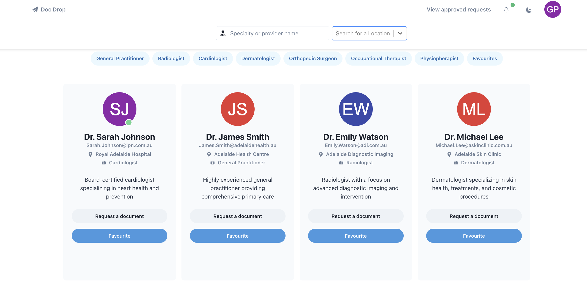
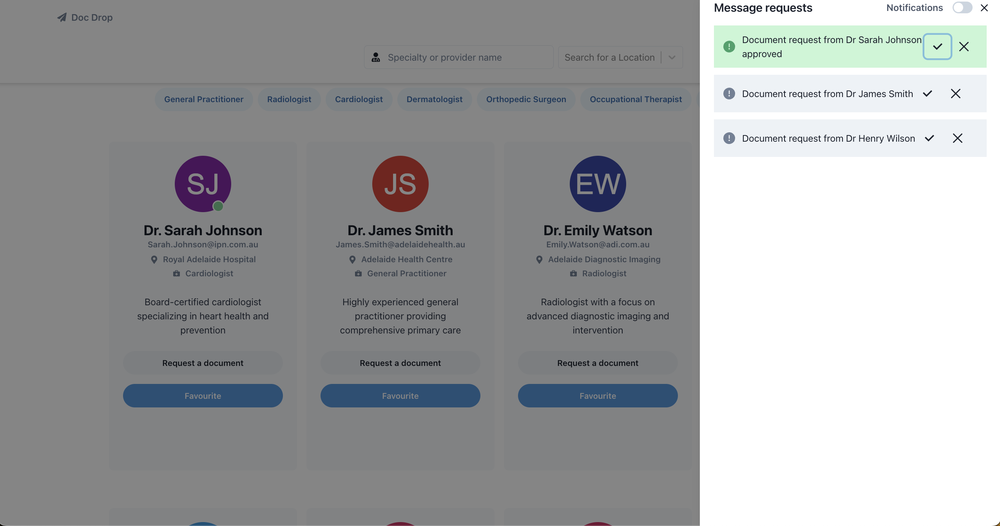
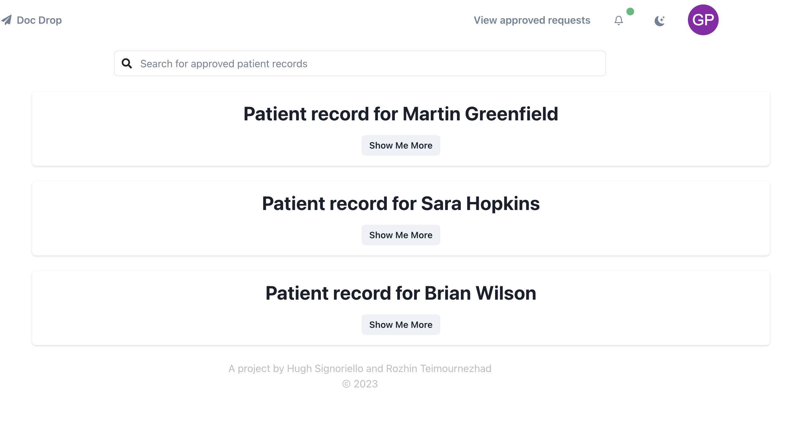
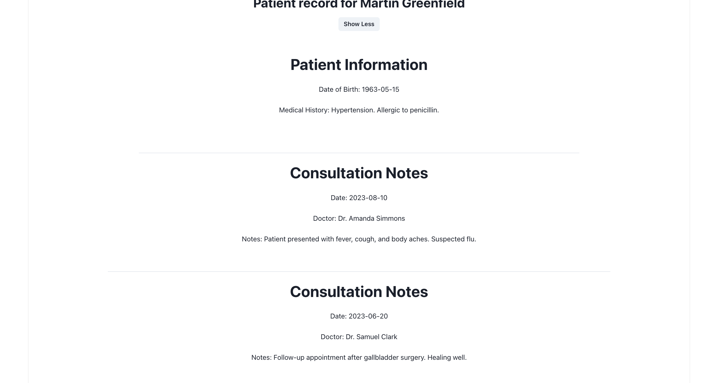

# Doc Drop

## Problem

Accessing patient records across various healthcare networks such as specialist centers, general practitioners, private practices, and clinics is cumbersome and time-consuming. The traditional means, such as phone calls and emails, consume junior doctors' time and detract from patient care.

## Solution

A web app that facilitates the request and sharing of specific patient data across healthcare practices.

## Features Overfiew

**Security:** Leverages existing firewall protection within healthcare practices to ensure confidentiality and security of patient records.

**User-Friendly Interface:** Similar to the Hotdoc homepage, the app is intuitive and requires no additional training for staff.

**Search Functionality:** Users can search other healthcare facilities or doctors practicing in specific locations.

**Request Form:** A form to request specific patient records like consultation notes, test results, last scans, medication history, etc. It includes patient identifiers and offers multiple ways to receive the requested records (email, fax, or directly through the app).

**Real-Time Notifications:** Upon a request, a notification appears on the requested clinic's desktop. An admin person or the patient's doctor can authorize sharing the records. If patient consent is needed, a real-time notifier can be sent to the requester.

**Cloud Integration:**: integration with cloud storage for ease of accesiblity

**Optional Participation:** Clinics can choose whether or not to use the platform, maintaining autonomy and patient privacy and our software is flexible and accounts for this.  

### Benefits

**Efficiency:** Significantly reduces the time and effort required to access patient records.

**Training Costs:** No additional training is needed, saving both time and money.

**Privacy Compliance:** Does not aggregate records in the same database, acting only as a communication platform while respecting patient privacy.

## Key Features

### search or filter doctors by name, field, favourites and by location.

### Make a document request to your desired clinician. This will send a notification on there view and if they approve your request you will have access to your desired patient records

### Approve or deny pending document request from other health professionals

### Search for approved patient records

### View patient records

## 2.1.1 Homepage

- [x] Navbar pages
- [x] The application shall provide a homepage that allows users to search for clinics, healthcare facilities, or specific doctors practicing in a given location.
- [x] The search results shall be displayed in an easily navigable format with relevant details.
- [x] Implement filtering and searching
- [x] Add location sorting and card
- [x] Notification left side bar approval
- [x] Fix patient record formatting
- [x] Add Ocupational Therapist, Add Physiopherapist
- [x] Add location filtering
- [x] Add professional filtering
- [x] Style patient profiles
- [x] message request hooks

### 2.2.1 Request Page

The application shall provide a page to request specific patient records. Users can select categories including:
Consultation notes
Test results
Last scans
Latest medication records
Medical history
The request form shall include the following patient identifiers:
Full name
Date of birth
Specific category of record requested (from the categories mentioned above)
The name, title, and work unit of the person making the request (can be a unit, practice, or specific doctor)

### Other

- [ ] Upload record pdf, document, and embed it (cloud drop)
- [x] use api for profile pictures
- [ ] form to request specific patient records like consultation notes, test results, last scans, medication history, etc. It includes patient identifiers and offers multiple ways to receive the requested records (email, fax, or directly through the app)]
- [x] Real time notification page: Upon a request, a notification appears on the requested clinic's desktop. An admin person or the patient's doctor can authorize sharing the records. If patient consent is needed, a real-time notifier can be sent to the requester.

### User stories

2.2.2 Record Transmission Options

The request form shall offer different ways to receive/send the requested records, including:
Email
Fax number
Directly through the application

2.2.3 Notifications
The application shall provide real-time notifications that appear on the requested clinic’s computer desktop to alert them of a new record request.

2.3 Authorization
Upon receiving the request, either an admin person at the reception or the patient’s doctor must authorize the sharing of the records.
In cases where the patient's consent is required for sharing the records, a real-time notifier shall be sent to the requester, informing them of the need for patient consent. 3. Compliance and Security
The application must comply with all applicable healthcare regulations and standards, including data privacy laws.
Adequate security measures must be implemented to ensure that patient data is handled and transmitted securely.

### Conclusion

The proposed web app aims to streamline the process of requesting and sharing patient records across various healthcare practices. By utilizing existing security measures and offering an intuitive, real-time solution, it facilitates smoother communication, efficiency, and maintains the privacy and autonomy of participating entities. It represents a technologically savvy approach to a longstanding issue in healthcare coordination.
